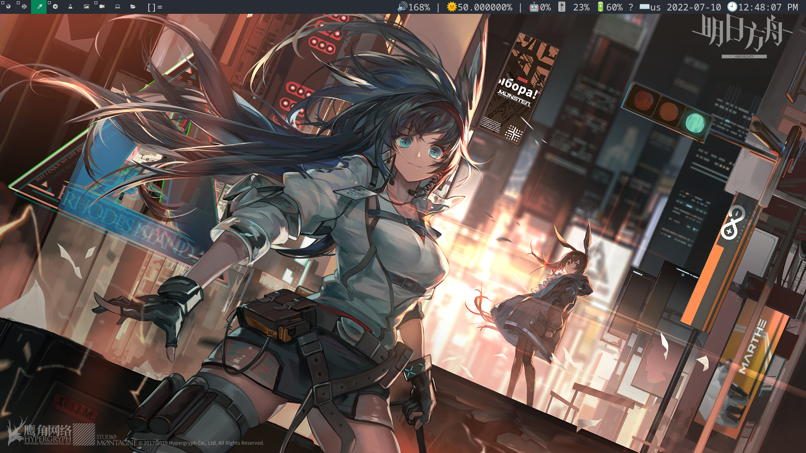
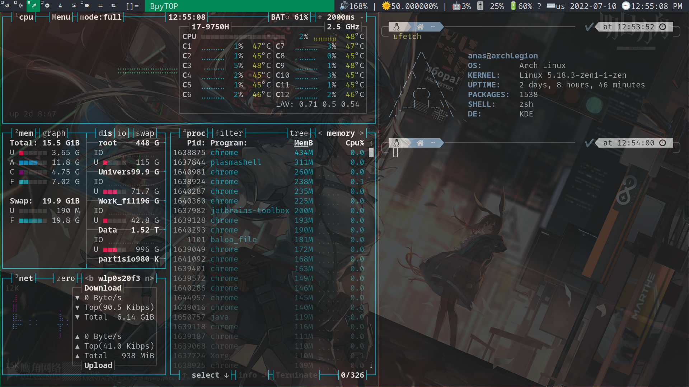
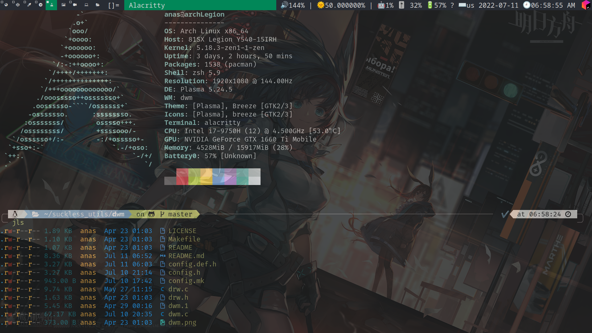
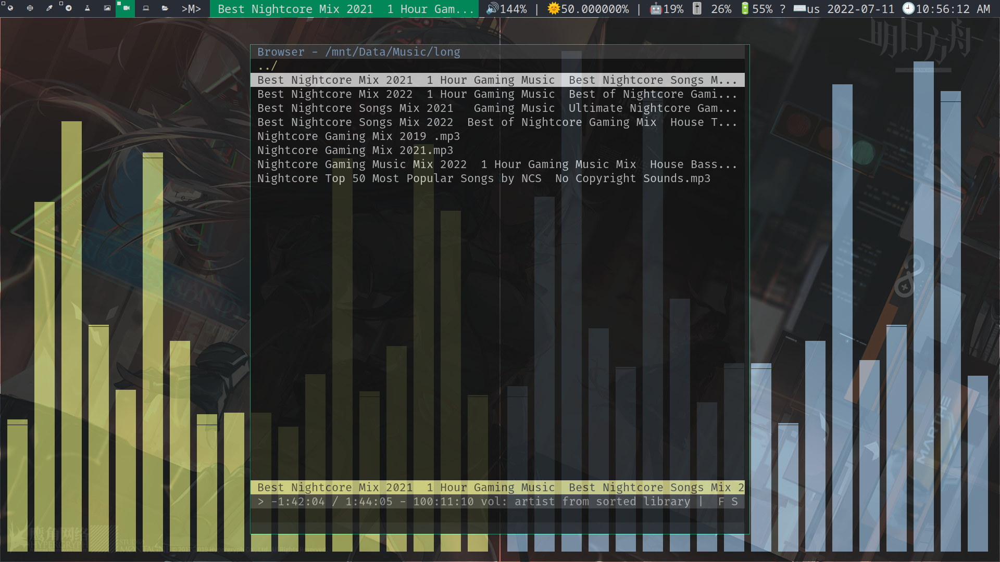

# Anas Elgarhy's dwm
## My fork from dwm 🍴, with a lot of beautiful patches 🥰






### Applayed patches:
- [alwayscenter](https://dwm.suckless.org/patches/alwayscenter)
- [cool autostart](https://dwm.suckless.org/patches/cool_autostart)
- [fullscreen](https://dwm.suckless.org/patches/fullscreen)
- [gridmode](https://dwm.suckless.org/patches/gridmode)
- [keychord](https://dwm.suckless.org/patches/keychord)
- [movestack](https://dwm.suckless.org/patches/movestack)
- [pertag](https://dwm.suckless.org/patches/pertag)
- [systray](https://dwm.suckless.org/patches/systray)
- [sticky](https://dwm.suckless.org/patches/sticky)
- [noborder](https://dwm.suckless.org/patches/noborder)
- [fibonacci layouts](https://dwm.suckless.org/patches/fibonacci)
- [centeredmaster](https://dwm.suckless.org/patches/centeredmaster)

### Keys
| Keys                           | Function                                                              |
|--------------------------------|-----------------------------------------------------------------------|
| modkey + shift + d             | Open dmenu (launcher)                                                 |
| modkey + shift + ctrl + d      | Open rofi launcher (small size)                                       |
| modkey + enter                 | Launche the main terminal (alacritty by default)                      |
| modkey + t -> a                | Launche the alacritty terminal                                        |
| modkey + t -> shift + a        | Launche the alacritty terminal with tmux                              |
| modkey + t -> k                | Launche the kitty terminal                                            |
| modkey + t -> shift + k        | Launche the kitty terminal with tmux                                  |
| modkey + shift + f -> g        | Launche the GUI file manger (pcmanfm by default)                      |
| modkey + shift + f -> f        | Launche rofi file file browser (small size)                           |
| modkey + shift + f -> t        | Launche the terminal file manger (ranger) in the main terminal        |
| modkey + w -> g                | Launche google chrome browser                                         |
| modkey + w -> t                | Launche tor browser                                                   |
| modkey + c -> d                | Launche discord                                                       |
| modkey + c -> o                | Launche obsidian                                                      |
| modkey + a -> j                | Launche jetbrains-toolbox                                             |
| modkey + a -> n                | Launche NeoVim in the main terminal                                   |
| modkey + a -> v                | Launche Vim in the main terminal                                      |
| modkey + a -> e                | Launche emacs                                                         |
| modkey + p -> b                | Launche the background manger (nitrogen by default)                   |
| modkey + p -> n                | Lanuche the network manager (nm-connection-editor)                    |
| modkey + e                     | Launche rofi emoji selector                                           |
| modkey + f                     | Toggle full screen mode                                               |
| modkey + b                     | Toggle the status bar (hide/show)                                     |
| modkey + j                     | Change the focus to privus window in the stack                        |
| modkey + k                     | Change the focus to the next window in the stack                      |
| modkey + i                     | Change the stack layout to virtecal                                   |
| modkey + d                     | Change the stack layout to horizontal                                 |
| modkey + h                     | Decrease the focus window size                                        |
| modkey + l                     | Increase the focus window size                                        |
| modkey + Tab                   | Toggle between the curent tag and the privus tag                      |
| modkey + shift + j             | Move the focus window down in the stack                               |
| modkey + shift + k             | Move the focus window up in the stack                                 |
| modkey + q -> q                | Quit from the focus window (kill it)                                  |
| modkey + s -> t                | Use the tile layout                                                   |
| modkey + s -> f                | Use the float layout                                                  |
| modkey + s -> m                | Use the monocle layout                                                |
| modkey + s -> g                | Use the grid layout                                                   |
| modkey + s -> r                | Use the spial layout (part from fibonacci layouts)                    |
| modkey + s -> shift + r        | Use the dwindle layout (part from fibonacci layouts)                  |
| modkey + s -> c                | Use the centerd master layout                                         |
| modkey + s -> shift + s        | Use the centerd floating master layout                                | 
| modkey + s -> space            | Toggle between current layout and tile layout                         |
| modkey + shift + s             | Toggle sticky mode                                                    |
| modkey + alt + f               | Toggle floating window                                                |
| modkey + m -> c                | Launche the cmus player                                               |
| modkey + m -> v                | Launche vlc video player                                              |
| modkey + m -> shift + v        | Lanuche nvlc in the main terminal                                     |
| modkey + 0                     | View all tags                                                         |
| modkey + shift + 0             | Mirror the current tag in all tags                                    |
| modkey + comma (,)             | -                                                                     |
| modkey + period (.)            | -                                                                     |
| modkey + shift + comma (,)     | -                                                                     |
| modkey + shift + period (.)    | -                                                                     |
| modkey + (1..9)                | Navigate between tags                                                 |
| modkey + shift + (1..9)        | Move the focus window to specific tag                                 |
| modkey + control + (1..9)      | -                                                                     |
| modkey + shift + ctrl + (1..9) | Mirror the current tag in specific tag                                |
| superkey + space               | Change the keyboard layout (ar, en)                                   |
| PrtSc                          | Take a screenshot using default screenshot tool (spectacle)           |
| modkey + shift + x             | Lock the screen (using betterlockscreen)                              |
| modkey + shift + alt + q       | Kill dwm                                                              |

> modkey = win key or super key

### Dependencies (apps)
- `google-chrome-stable` the main web browser
- `alacritty` the main terminal
- `spectacle` the main screenshot tool 
- `pcmanfm` the GUI file manger
- `rofi`
- `dmenu`
- `libxinerama-dev`\*\*
- `tmux`\*
- `tor-browser`
- `discord`
- `libxft-bgra` for color emojies support
- `jetbrains-toolbox`
- `nvim`\*
- `vim`\*
- `xbacklight` for control in the screen brightness
- `pamixer` for control in the audio level
- `playerctl` for control in the media
- `pactl` for control in the mic
- `betterlockscreen` for lock screen
- `setxkbmap` for switch between keyboard layouts, like (ar, en)
- `slstatus` the status bar
- `network-manager-applet` 
- `picom` compositor , for transparency
- `nitrogen` for set the wallpaper
- `copyq` clipboard manager
- `obsidian`

> \*\*: build dependencie.

### Install
- Manual:
  1. Run this command to install all avilable dependencies in standerd arch repostory
    ```bash
    sudo pacman -S google-chrome libxft-bgra rofi dmenu tmux tor-browser discord neovim jetbrains-toolbox vim pamixer playerctl betterlockscreen pcmanfm spectacle alacritty picom nitrogen libxinerama network-manager-applet copyq obsidian
    ```
    2. Install yay if you not installed it.
    3. Run this command to install all avilable dependencies in the AUR repostory `yay -S xkblayout`
    4. Clone this repostory `git clone https://github.com/anas-elgarhy/dwm-anas.git`
    5. Go to the source directory `cd dwm-anas/src`
    6. Build and install `sudo make install clean`
    7. Enjoy 😉


### Available in 

[](https://github.com/anas-elgarhy/dwm-anas)
[](https://gitlab.com/anas-elgarhy/dwm-anas)
[](https://bitbucket.org/anas_elgarhy/dwm-anas)
[](https://codeberg.org/anas-elgarhy/dwm-anas)

### Refrences:
- [XF86keysym](https://cgit.freedesktop.org/xorg/proto/x11proto/tree/XF86keysym.h)
