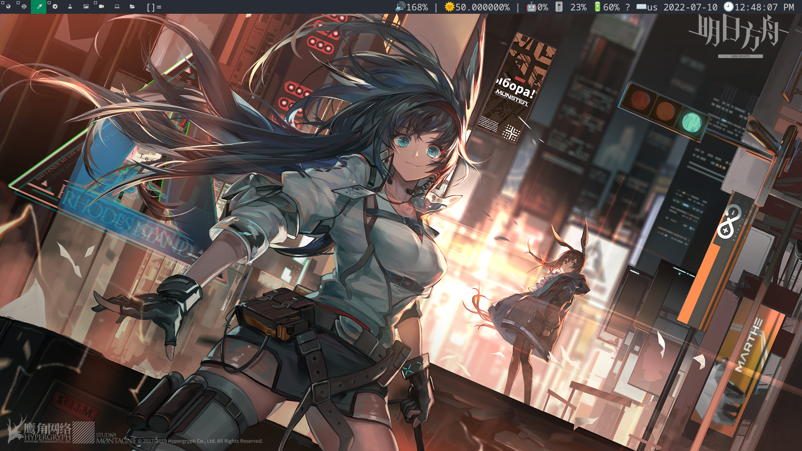
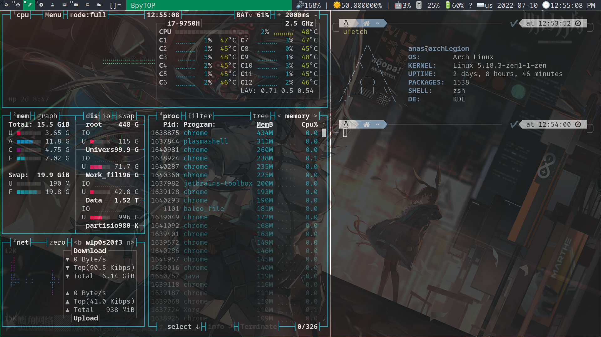

# Anas Elgarhy's dwm
## My fork from dwm 🍴, with a loat of a beutaful patches 🥰

### Applayed patches:
- [alwayscenter]()
- [cool autostart]()
- [fullscreen]()
- [gridmode]()
- [keychord]()
- [movestack]()
- [pertag]()
- [systray]()

### Keys
| Keys                           | Function                                           |
|--------------------------------|----------------------------------------------------|
| modkey + shift + d             | Open dmenu (launcher)                              |
| modkey + shift + ctrl          | Open rofi launcher (small size)                    |
| modkey + enter                 | Launche the main terminal (alacritty by default)      |
| modkey + t -> 1                | Launche the main terminal with tmux                   |
| modkey + shift + f -> g        | Launche the GUI file manger (dolphin by default)      |
| modkey + shift + f -> r        | Launche rofi file file browser (small size)           |
| modkey + w -> g                | Launche google chrome browser                         |
| modkey + w -> t                | Launche tor browser                                   |
| modkey + c -> d                | Launche discord                                      |
| modkey + a -> j                | Launche jetbrains-toolbox                            |
| modkey + a -> n                | Launche NeoVim in the main terminal                  |
| modkey + a -> v                | Launche Vim in the main terminal                     |
| modkey + e                     | Launche rofi emoji selector                          |
| modkey + f                     | Toggle full screen mode                              |
| modkey + b                     | Toggle the status bar (hide/show)                    |
| modkey + j                     | Change the focus to privus window in the stack       |
| modkey + k                     | Change the focus to the next window in the stack     |
| modkey + i                     | Change the stack layout to virtecal                  |
| modkey + d                     | Change the stack layout to horizontal                |
| modkey + h                     | Decrease the focus window size                       |
| modkey + l                     | Increase the focus window size                       |
| modkey + Tab                   | Toggle between the curent tag and the privus tag     |
| modkey + shift + j             | Move the focus window down in the stack              |
| modkey + shift + k             | Move the focus window up in the stack                |
| modkey + q -> q                | Quit from the focus window (kill it)                 |
| modkey + s -> t                | Use the tile layout                                  |
| modkey + s -> f                | Use the float layout                                  |
| modkey + s -> m                | Use the monocle layout                                  |
| modkey + s -> g                | Use the grid layout                                  |
| modkey + s -> space            | Toggle between current layout and tile layout        |
| modkey + alt + f               | Toggle floating window                               |
| modkey + 0                     | View all tags                                         |
| modkey + shift + 0             | Mirror the current tag in all tags                   |
| modkey + comma (,)             | -                                                    |
| modkey + period (.)            | -                                                    |
| modkey + shift + comma (,)     | -                                                    |
| modkey + shift + period (.)    | -                                                    |
| modkey + (1..9)                | Navigate between tags                                |
| PrtSc                          | Take a screenshot using default screenshot tool (spectacle) |
| modkey + shift + x             | Lock the screen (using betterlockscreen)             |
| modkey + shift + ctrl + x      | Plasma screen server                                 |
| modkey + shift + alt + q       | Kill dwm                                             |

> modkey = win key or super key

### Dependencies (apps)
- google-chrome-stable
- alacritty
- spectacle 
- dolphin 
- rofi
- dmenu
- libxinerama1
- libxinerama-dev
- tmux\*
- tor-browser
- discord
- jetbrains-toolbox
- nvim\*
- vim\*
- xbacklight
- pamixer
- playerctl
- pactl
- betterlockscreen

